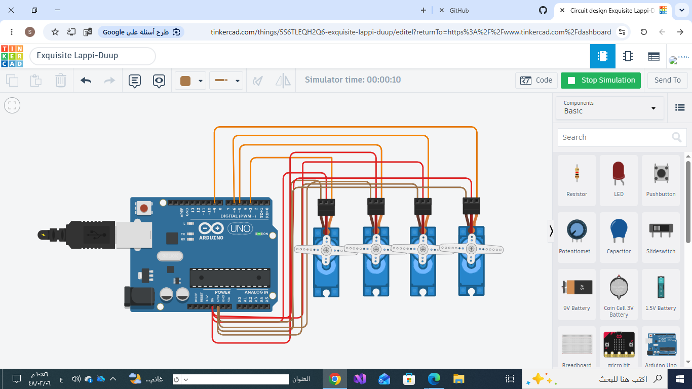

# 4-Servo-Sweep-Control
Arduino project controlling four servo motors using the Sweep motion for 2 seconds, then holding all servos at 90 degrees.

# Multi Servo Control

## Overview
This project demonstrates how to control four servo motors simultaneously using an Arduino Uno.

The servo motors perform a sweep motion for two seconds and then stop at a fixed position of 90 degrees.

## Hardware
- Arduino Uno
- 4 Micro Servo Motors
- Jumper Wires

## Pin Connections
- Servo 1 → D3
- Servo 2 → D5
- Servo 3 → D6
- Servo 4 → D9

## Functionality
- Controls four servo motors simultaneously.
- Performs sweep motion for 2 seconds.
- Stops all servos at 90°.
- Uses the Arduino Servo library.

## Files
- Servo_Control.ino
- README.md
- circuit.png (Circuit Screenshot)

## Simulation

The following image shows the simulation after the servo motors complete the sweep motion and stop at 90 degrees.

## Tinkercad Simulationhttps
://www.tinkercad.com/things/5S6TLEQH2Q6-exquisite-lappi-duup

## Author
Sara Saud Alotaibi
